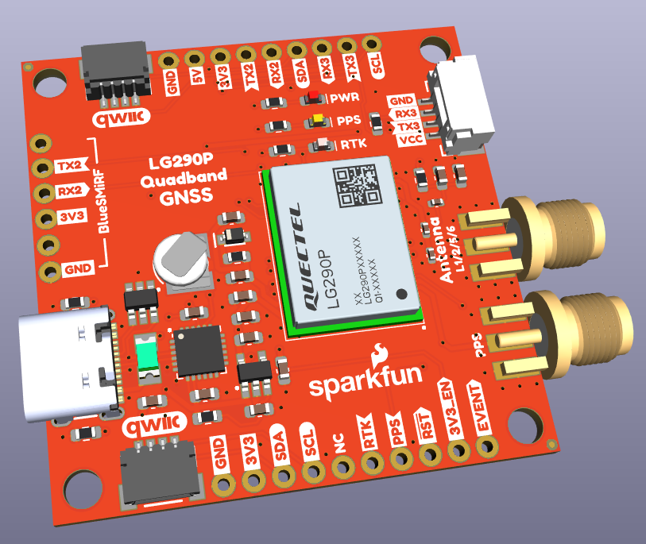
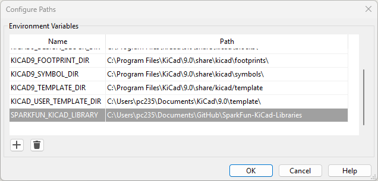
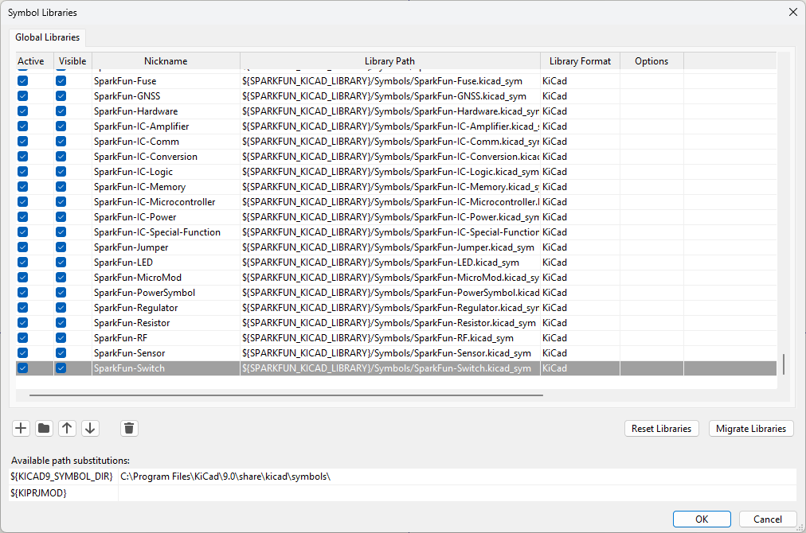
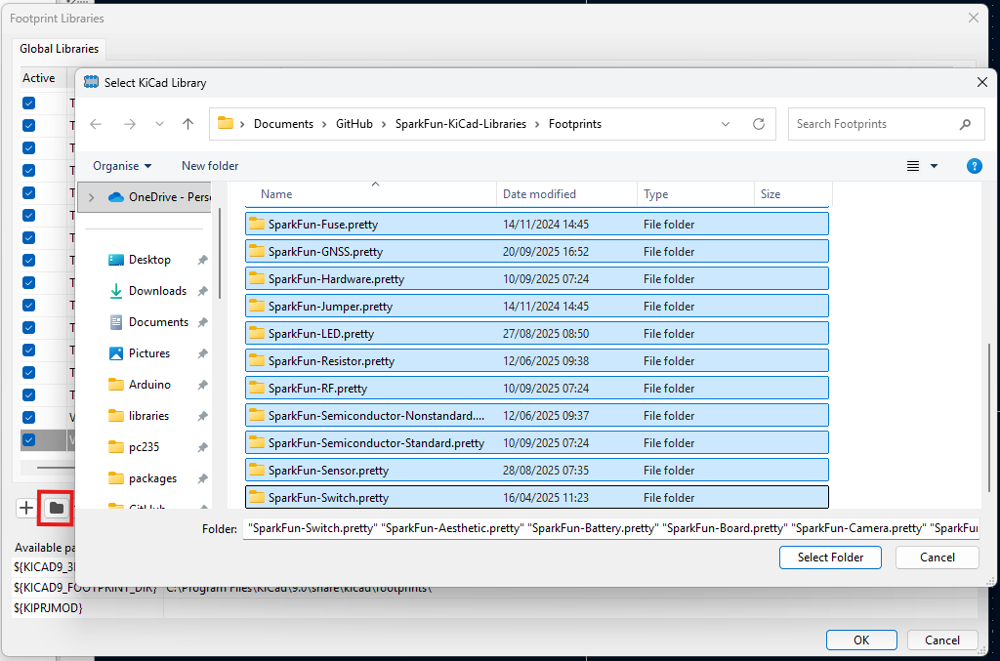

SparkFun Electronics KiCad Libraries
====================================

This repository contains the SparkFun KiCad Library of commonly used parts. It is a cultivated combination of KiCad stock parts,  SparkFun-unique footprints, and open-source 3D models. The main branch is generally proven out but we apologize in advance if this library has errors. Please report any issues! We'll fix them quickly.

**Note:** The SparkFun KiCad components contain internal part numbers (**PROD_ID-\***) for ease of manufacture for the SparkFun SMD lines. 

## Theory

KiCad is very good and has a large number of industry specified symbols and footprints. SparkFun has a large number of unique parts and components created since 2002. Rather than converting all previous [SparkFun Eagle libraries](https://github.com/sparkfun/SparkFun-Eagle-Libraries) to KiCad, we are adding new parts to this library as we need them for new projects. This gives us the opportunity to clear out old badness, but opens the door to new badness (ie, incorrect footprints) so reader beware!

The SparkFun approach: when a new part needs to be added we decide whether to use a KiCad stock symbol, edit it for use, or create it from scratch. We give preference to the stock KiCad symbol. We give heavy preference to using the original SparkFun footprint, but look at the stock KiCad footprint for inspiration as well. We'll try to follow the [KiCad Library Conventions](https://klc.kicad.org/) where it makes sense.

Additionally, SparkFun needs to assign various unique manufacturing data (ie, internal part numbers) to parts. To alleviate this, there is a large number of components with an identical symbol each with their own production ID information. For example, capacitors:

We use the following naming conventions to create our 'bubble gum' parts: 

* [capacity]\_[size]\_[voltage]_[tolerance]
* [resistance]\_[size]\_[wattage optional]_[tolerance optional]
* [inductance]\_[size]\_[max current]
* [led color]\_[size]\_[wavelength optional]

## Installing and using these libraries

The structure of these libraries is close to, but does not conform to the [KiCad Content libraries structure](https://dev-docs.kicad.org/en/addons/#_content_libraries). For that reason, you won't currently find these libraries in the KiCad Plugin and Content Manager.

### Download ZIP

You can download a copy of the library by clicking on the big green `<> Code` button above and selecting the `Download ZIP` option. Unzip the file somewhere convenient, usually in `Documents`. Open the KiCad **Symbol Editor** and navigate to `Preferences \ Configure Paths`. Add a new Environmental Variable called `SPARKFUN_KICAD_LIBRARY` and set the Path to the `SparkFun-KiCad-Libraries` folder :

Then navigate to `Preferences \ Manage Symbol Libraries`. Click the folder button to "Add existing library to table". Navigate to the `SparkFun-KiCad-Libraries \ Symbols` folder, select all the `SparkFun-.kicad_sym` symbol files and click `Open` :

Then likewise in the **Footprint Editor**, navigate to `Preferences \ Manage Footprint Libraries` and use the folder button to "Add existing (KiCad folder)". Select everything except the `3D-Models` folder (Strictly, that one is in the wrong place. Sorry about that) and click `Select Folder` :

### Using Git

If you're familiar with GitHub and Git / [GitHub Desktop](https://desktop.github.com/download/), you can stay completely up to date by cloning this repo.

Again, add the Symbols and Footprints Paths as described in the previous section.

If you use the "Watch All Activity" option above, you will be notified each time we Push or Merge changes in the libraries. You can then Pull the changes to stay completely up to date. (It's what we do!)

Contents
-------------------

* [/Footprints](https://github.com/sparkfun/SparkFun-KiCad-Libraries/tree/main/Footprints) -- PCB footprints
* [/Symbols](https://github.com/sparkfun/SparkFun-KiCad-Libraries/tree/main/Symbols) -- Schematic symbols

License
-------------------

This library is released under the [Creative Commons Attribution 4.0 International](https://creativecommons.org/licenses/by/4.0/) license. 
**You are welcome to use this library for commercial purposes.**
For attribution, we ask that when you begin to sell your device using our footprint, you email us with a link to the product being sold. 
We want bragging rights that we helped (in a very small part) to create your 8th world wonder. 
We would like the opportunity to feature your device on our homepage.

Please consider contributing back to this library or others to help the open-source hardware community continue to thrive and grow! 

- Your friends at SparkFun